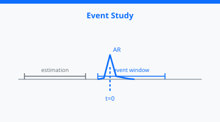
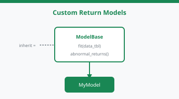
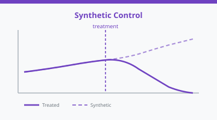
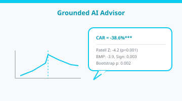
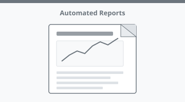

# Gallery

## Core Workflow

Introducing EventStudy

Core Workflow

Result Extraction & Export

Core Workflow

Diagnostics & Validation

Core Workflow

Bootstrap Inference & Multiple Testing

Core Workflow

## Return Models

Factor Models, GARCH & BHAR

Return Models

Time-Varying Volatility Models

Return Models

Custom Return Models

Return Models

Volume & Volatility Event Studies

Return Models

## Test Statistics

Custom Test Statistics

Test Statistics

## Advanced Designs

Panel DiD Event Studies

Advanced Designs

Modern DiD Estimators

Advanced Designs

Intraday Event Studies

Advanced Designs

Synthetic Control

Advanced Designs

## Cross-Sectional & Simulation

Cross-Sectional Analysis

Cross-Sectional & Simulation

Monte Carlo Power Analysis

Cross-Sectional & Simulation

## AI Advisor

Grounded AI Advisor

AI Advisor

## Data & Reporting

Downloading Stock & Factor Data

Data & Reporting

Automated Reporting

Data & Reporting
